# Эпоха славных дел

## Категории
1.  [Потешные дела](#потешные-дела)
2.  [На первой полосе ведомостей](#на-первой-полосе-ведомостей)
3.  [Дела Тайной канцелярии](#дела-тайной-канцелярии)
4.  [Великие лета](#великие-лета)
5.  [Наставники его Величества](#наставники-его-величества)
6.  [Сподвижники и противники царя](#сподвижники-и-противники-царя)
7.  [Палата редкостей](#палата-редкостей)
8.  [Потаённая цифирь](#потаённая-цифирь)
9.  [Камера обскура](#камера-обскура)
10. [Catalogus 1725 года](#catalogus-1725-года)
11. [Табеля о рангах](#табеля-о-рангах)

## Потешные дела

### Стефан в шоке

**Стоимость:** 15

**Описание:** На какие крайние меры пошёл Пётр I для восстановления артиллерии?

**Варианты ответов:**

- [ ] Использовал реликвии царей
- [ ] Закупал ресурсы по невероятным ценам
- [x] Переплавлял колокола
- [ ] Увеличил налог для крестьян 

---

### Многодетная семья

**Стоимость:** 10

**Описание:** Сколько отпрысков было у Петра I от первой и второй супруги?

**Варианты ответов:**

- [ ] 4 и 6
- [x] 2 и 8
- [ ] 2 и 7
- [ ] 3 и 5

---

### Заграничные гостинцы

**Стоимость:** 10

**Описание:** Что Петр I не ввез в Россию?

**Варианты ответов:**

- [ ] Табак
- [ ] Кофе
- [x] Огурец
- [ ] Парики

---

### Путешествие за границу

**Стоимость:** 10

**Описание:** Сколько дипломатических поездок совершил в Европу Петр I ?

**Варианты ответов:**

- [x] 2
- [ ] 4
- [ ] 3
- [ ] 1

---

### Сколько там их было…

**Стоимость:** 15

**Описание:** Какой по счету царь в роде Романовых Петр I ?

**Варианты ответов:**

- [x] 4
- [ ] 5
- [ ] 6
- [ ] 3

---

### Легенды потрясности

**Стоимость:** 10

**Описание:** Какой легенды о Петре Первом никогда не существовало?

**Варианты ответов:**

- [ ] Петр Первый был подменен еще во младенчестве
- [ ] Петр Первый был подменен а «новый» Петр является Антихристом
- [x] Петр Первый был подменен во время смерти, а настоящий Петр жив и скрывается в тайге
- [ ] Петр Первый был подменен во время путешествия в Европу

---

### Порядковый номер на рукаве…

**Стоимость:** 20

**Описание:** Есть свидетельствования о том, что во времена Петра Первого на запястья солдат наносилась татуировка. Что на ней было изображено?

**Варианты ответов:**

- [x] Крест
- [ ] Корабль/лодка
- [ ] Буква В
- [ ] Слово «Пётр»

---

### Еще одно учреждение

**Стоимость:** 10

**Описание:** В связи с частыми путешествиями Петра Великого, был создан орган власти, непосредственно подчинявшийся царю и контролирующий страну во время его отсутствия. Как он назывался?

**Варианты ответов:**

- [ ] Великое посольство
- [ ] Никакого органа не было
- [x] Правительствующий Сенат
- [ ] Петропавловский собор

---

### Начало положено

**Стоимость:** 10

**Описание:** Как был назван первый парусный фрегат, сделанный на Руси и принимавший участие в Северной войне?

**Варианты ответов:**

- [ ] «Самсон»
- [x] «Штандарт»
- [ ] «Святой Яков»
- [ ] «Гангут»

---

### История

**Стоимость:** 10

**Описание:** Как назывался первый музей на Руси? Его, кстати, основал Петр Первый.

**Варианты ответов:**

- [ ] «Лувр»
- [ ] «Эрмитаж»
- [ ] «Монплезир»
- [x] «Кунсткамера»

---

### Неоригинальная дата

**Стоимость:** 10

**Описание:** Раньше этот праздник праздновался 1-го марта, но Петр Первый перенес его, что это за праздник?

**Варианты ответов:**

- [x] Новый год
- [ ] Масленица
- [ ] День дурака
- [ ] Ничего из вышеперечисленного

---

### Если вдруг что-то случится…

**Стоимость:** 20

**Описание:** В 1711 году в ходе Прутского похода Петр Первый написал письмо российским сенаторам, в котором указывал, что они должны делать если ЭТО произойдет. Что ЭТО за случай и какие указания дал Петр Первый?

**Варианты ответов:**

- [x] Пленение Петра. 1) Не считать его царем; 2) Не исполнять его поручений
- [ ] Убийство Петра. 1) Захоронить его в соборе Петропавловской крепости; 2) Считать его преемником Екатерину
- [ ] Убийство Петра. 1) Считать Екатерину царицей; 2) Считать Екатерину своей женой
- [ ] Окружение армии. 1) Драться не на жизнь, а на смерть. 2) Любой ценой переправиться через реку

---

### Время основывать города, а место им будет…

**Стоимость:** 20

**Описание:** Основание какого города можно охарактеризовать данной картинкой?

- [ ] Петрозаводск
- [ ] Петербург
- [x] Петровск
- [ ] Петергоф

**Решение:** На картинке подписано название реки «Медведица». Нужно узнать, какой из городов, основанных Петром, стоит на этой реке.

---

### Доверие - самое ценное, что есть у людей

**Стоимость:** 20

**Описание:** Почему П.А.Толстой доверял послу Молдавии?

**Варианты ответов:**

- [x] Посол Молдавии дал тайно присягу Петру I
- [ ] Посол Молдавии был частым гостем в посольстве России, у них сложились хорошие отношения
- [ ] До встречи с П.А.Толстым посол Молдавии в течение 6 лет занимался разведывательной деятельностью в пользу России
- [ ] После борьбы за престол посол Молдавии объявил войну турецкому султану – главному врагу России, и стремился помочь Петру I

---

### Друг в беде не бросит

**Стоимость:** 15

**Описание:** Кто спас жизнь Петру I в Полтавской битве?

**Варианты ответов:**

- [ ] Иветта
- [x] Лизетта
- [ ] Мюзетта
- [ ] Жоржетта

---

### Маленький Петр знает ответ

**Стоимость:** 15

**Описание:** ОН был отправлен для переговоров в Крым, за 7 лет до смерти стал тайным советником. А также в честь него названа улица в Санкт-Петербурге, сможете узнать, кто это?

**Варианты ответов:** 

- [ ] Петр Павлович Шафиров
- [ ] Борис Иванович Куракин
- [x] Никита Моисеевич Зотов
- [ ] Андрей Константинович Нартов

---

### Стреляйте, капитан!

**Стоимость:** 20

**Описание:** Он обучил Петра огнестрельному делу, а где построил крепость?

**Варианты ответов:**

- [x] село Воробьево
- [ ] село Преображенское
- [ ] село Измайлово
- [ ] Александровская слобода

---

### Давайте познакомимся, сударь

**Стоимость:** 20

**Описание:** В поэме А.С. Пушкина “Полтава” 4 верных полководца Петра Первого упоминаются пофамильно, однако только ОН описан красивыми эпитетами поэта. Так кто же он?

**Варианты ответов:** 

- [ ] Франц Яковлевич Лефорт
- [ ] Борис Петрович Шереметев
- [x] Александр Данилович Меньшиков
- [ ] Федор Иванович Прокопович

---

### Значит Вы граф?

**Стоимость:** 20

**Описание:** Во время Северной войны ОН руководил войсками в Пскове. Что подарили ЕМУ в Риге?

**Варианты ответов:** 

- [ ] Портрет Петра I, украшенный алмазами
- [x] Два ключа
- [ ] Трость
- [ ] Сабля

---

### Экскурсия по местам Петра

**Стоимость:** 20

**Описание:** Напротив Кунсткамеры находится монумент, в каком городе стоит такой же памятник?

**Варианты ответов:**

- [ ] Париж
- [ ] Москва
- [x] Зандам
- [ ] Петропавловск

---

## На первой полосе Ведомостей

### Как такое возможно?

**Стоимость:** 30

**Описание:** Петр I был и последним ___ и первым ___

**Формат:** слово_слово

**Ответ:** царем_императором/царь_император

**Решение:** Нужно поискать информацию в разных источниках и сопоставить, что Петр I был первым императором и последним царем.

---

### Император, царь?

**Стоимость:** 60

**Описание:** Кто я, наверное, вы догадались, а вот что это за место?

**Формат:** Слово_Слово

**Ответ:** Домик_Петра

**Решение:** Ищем строения Петра Первого и сверяем их с прикрепленной фотографией.

---

### Начинаем вспоминать достижения Петра

**Стоимость:** 40

**Описание:** В каком году начали формироваться ЭТИ подразделения, ставшие основой Преображенского и Семеновского полков? И как они назывались?

**Формат:** год_Название_название

**Ответ:** 1683_Потешный_полк/1683_Потешные_полки

**Решение:** Для получения ответа нужно прочитать про судьбу Преображенского и Семеновского полков.

---

### Дом верных товарищей

**Стоимость:** 70

**Описание:** ЭТО здание Петр I построил для одного адмирала. После его смерти, это же строение перешло к другому сподвижнику Императора, а сейчас здесь хранятся голосовые архивные документы. Как называется это здание?

**Формат:** Слово_слово

**Ответ:** Лефортовский_дворец

**Решение:** Ищем здания, которые строил Петр, среди них находим то, которое изначально принадлежало адмиралу Лефорту, а после его смерти перешло к Меншикову.

---

### Не все города, основанные Петром, названы в честь него

**Стоимость:** 50

**Описание:** Сможете ли вы понять, что это за город по его описанию? Сейчас он находится на расстоянии 1164 км от Москвы. В свое время строился как портовый пограничный город. Укажите название города.

**Ответ:** Таганрог

**Решение:** Находим перечень основанных Петром городов, среди них выделяем имеющие выход к морю, а далее проверяем расстояние.

---

### А грамоте то вы обучены?

**Стоимость:** 60

**Описание:** Как вы знаете, изучая историю, часто приходится работать с довольно старыми источниками. Предлагаю вам потренироваться их читать. Перед вами первая страница выпуска Ведомостей, описывающего военный поход. Ваша задача понять, как называется местность, в которой происходят события.

Не забудьте, написание многих слов могло поменяться. Используйте то написание, что используется сейчас.

**Формат:** Слово_Слово

**Ответ:** Шведские_Шхеры

**Решение:** Находим что-то похожее на название местности «Шеведские Шеры». Забиваем в гугл. Исправляет на «Шведские Шхеры».

---

### И читать умеют, и искать. Лепота.

**Стоимость:** 70

**Описание:** А сейчас задача посложнее. Вам нужно найти выпуск Ведомостей за март 1713 года, в котором описывались события февраля. Ответьте, что попало и усилилось в королевском дворе, заставив всех выбежать.

**Ответ:** Огонь

**Решение:** Прямым текстом говорится, что нужно найти данный выпуск (что достаточно легко, есть архивные выпуски Ведомостей), и прочитать его (а вот это задача посложнее, и объем больше). А там на первых страницах говорится о случившимся.

---

### Как бы понять, о чем они пишут

**Стоимость:** 50

**Описание:** Раньше о пребывании Петра в Санкт-Петербурге в Ведомостях писали, будто государь находится в походе. Вопрос, после переезда чего, нахождение царя в этом городе перестали считать походом?

**Формат:** Слово_слово

**Ответ:** Правительствующий_сенат

**Решение:** Событие связано с переездом столицы в Петербург.

---

### Разрешить! Нет! Запретить! Нет! Разрешить! Но немножко

**Стоимость:** 60

**Описание:** Это было запрещено Патриархом после Московского пожара 1634 года, но легализовано при Петре. Эту легализацию поддержал представитель церкви. Какое имя у него было?

**Ответ:** Адриан

**Решение:** Название дает понять, что это одно из спорных нововведений Петра. А конкретно - легализация табака. И именно Патриарх Адриан поддержал в этом императора.

---

### Маршрут построен

**Стоимость:** 100

**Описание:** Предлагаем вам пройти по памятному маршруту от места захоронения Петра. Ваша задача ответить на вопрос. Что это за место?

Выйдите из главного входа.

Пройдите прямо, как упретесь в здание, сверните направо.

Пройдите через Никольские ворота (будьте аккуратны, ведь вы двигаетесь через тюрьму бастиона).

Двигайтесь налево, к набережной.

Пройдите по мосту

Сверните налево и двигайтесь вдоль набережной до следующего моста

Пройдите по мосту

Еще не потерялись? Сверните налево и двигайтесь вдоль набережной до следующего моста

Пройдите по мосту

Направо, 560 м

Прямо, 40 м

Вы достигли пункта назначения!

**Ответ:** Медный всадник

**Решение:**  Следуем координатам, в конце находится памятник, это и есть ответ

---

### Известия ли?

**Стоимость:** 90

**Описание:** Идея периодически извещать народонаселение своего государства о происходящих событиях из официального источника очень понравилась Петру. Назовите самое первое такое издание.

**Ответ:** Юрнал/Юрнал_об_осаде_крепости_Нотенбурга/Поденная_роспись_об_осаде_крепости_Нотенбурга

**Решение:** «Юрнал или поденная роспись об осаде крепости Нотенбург»  — первое периодическое издание в русском государстве.

---

### Исконная земля

**Стоимость:** 60

**Описание:** Против Швеции в 1699 был создан Северный союз. Каждый из его участников преследовал свои цели. Петру было важно не только Балтийское море, но и восстановление территориальной целостности своей страны. Одна из отобранных территорий как-то связана с рекой. Укажите её название.

**Ответ:** Ингерманландия

**Решение:** Из описаний о Северной войне и её причинах узнаем, что Петр I хотел вернуть побережье Финского залива — Ингерманландию.

---

### Благие намерения

**Стоимость:** 50

**Описание:** Во избежание борьбы за престол Петр учредил устав о престолонаследии, по которому правящий монарх сам определял себе приемника. А кому Петр I завещал империю?

**Ответ:** Никому

**Решение:** Петр I сам отменил привычную процедуру престолонаследия (по мужской линии от отца к сыну), а назначить себе преемника не успел.

---

### Неумехи?

**Стоимость:** 60

**Описание:** Освоение необъятных зауральских просторов продолжалось и во время царствования Петра. Уже немного прижившиеся русские стали помогать местным защищаться от набегов других народов. Один такой поход к реке Анадырь стоил жизни десятков казаков и юкагиров, врагов было, по некоторым свидетельствам, тысячи. Назовите народ, с которым пришлось сразиться.

**Ответ:** Чукчи

**Решение:** Почитав про освоение Сибири во времена Петра Первого можно найти упоминания об Анадырской экспедиции по завоеванию Чукотки.

---

## Дела тайной канцелярии

### Шпион Петра I

**Стоимость:** 80

**Описание:** ОН тайно работал в других странах и вербовал иностранных специалистов. Его отец был одним из инициаторов создания Артаксерксова действа.

Отправившись на очередную тайную операцию, ОН должен был добиться определенных результатов по Семилетней войне. По итогу этого действия одна страна не стала участвовать в военных действиях.

Укажите название этой страны.

**Ответ:** Голландия

**Решение:** Ищем, что такое Артаксерксово действо, узнаем, что это первый в России театр, узнаем, что одним из инициаторов был Матвеев Артамон Сергеевич, соответственно его сын - это Матвеев Андрей Артамонович. Читаем разные статьи и понимаем, что Важным итогом миссии стало сохранение Голландией нейтралитета в Северной войне.

---

### Точно не философ

**Стоимость:** 70

**Описание:** Платон приехал со своей тайной миссии в 1720 году и через 10 лет стал губернатором Смоленской губернии. Однако этому предшествовали некоторые события. Например, он познакомился с тогда еще будущим зятем Петра I. А еще со своим отцом, который был президентом Московской Сенатской конторы в 1727 году и провел инспекцию в монетном дворе.

Но что же все-таки делал Платон в 1720 году? Укажите, подписанию какого документа он способствовал?

**Ответ:** Ни­штадт­ский_ми­р/Ништадтский_мирный_договор

**Решение:** Ищем, кто был президентом Московской Сенатской конторы, первым в списке попадает Матвеев, однако он не подходит по году, указанному в задании, и он не работал вместе с сыном, значит это Иван Мусин-Пушкин, читаем биографию его сына, находим ответ.

---

### Разведчики везде

**Стоимость:** 80

**Описание:** «Необходимо выведывать и описывать тамошние народы; состояние;

какое там правление; какие правительственные лица; какие у них с другими

государствами будут поступки в воинских и политических делах; к войне тайные

приготовления…» , это было сказано одному дипломату. Один из родственников соратника доставлял тайные переписки, а также сам являлся источником информации, кто это был?

**Ответ:**  Спилиот

**Решение:** Ищем цитату, находим статью про Петра Толстого, читаем, понимаем, что соратником является Иерусалимский Досифей, далее ищем статьи, где упоминаются родственники Досифея, действительно, его племянник доставлял тайную информацию.

---

### А ты знаешь Санкт-Петербург?

**Стоимость:** 60

**Описание:** Эти две карты на первый взгляд не имеют ничего общего, но их объединяет один изобретатель. Кто он?

**Формат ответа:** Фамилия_Имя_Отчество

**Ответ:** Корчмин_Василий_Дмитриевич

**Решение:** Гуглим карту, это оказывается Васильевский остров в Санкт-Петербурге, смотрим достопримечательности, один из них памятник Корчмину, проверяем по старой карте, понимаем, что это на самом деле он потому, что Василий Дмитриевич вел разведку этой крепости.

---

### Почта России 1705

**Стоимость:** 80

**Описание:** Странный, однако, файл, а сможете при помощи него указать, какой город был подвержен реформам?

[Почта России](assets/secret%20cases/RussianPost.psd)

**Ответ:** Митава

**Решение:** Смотрим на картинку, ищем в слоях нужное, находим слово перлюстрация, портрет Виниуса, гуглим, читаем статью.

---

### Из глубины веков

**Стоимость:** 70

**Описание:** Мы случайно обнаружили необычную картинку у нашего сотрудника. Он говорит, что вдохновился этой историей и теперь специалист в области генеалогии, не будем его в этом разочаровывать.

Назовите политический орган, основанный во время правления Петра I и, который был непосредственно связан с сыном Юрия. 

**Формат ответа:** Слово_слово

**Ответ:** Преображенский_приказ

**Решение:** Смотрим на картинку, понимаем, что это генеалогическое дерево, главный предок Рюрик, ищем, кто у него был потомком с именем и отчеством, указанном на фото, понимаем, что это род Ромодановских. Политический орган, основанный во время Петра I и связанный с Ромодановским - это Преображенский приказ.

---

### Божиею милостию, Великий Государь Царь и Великий Князь …

**Стоимость:** 60

**Описание:** Название задания - это начало титула царя Михаила Федоровича. А сможете ли вы найти полное наименование должности того, кто занимался восстановлением архива одного царского приказа, занимавшимся внутренней разведкой? Ответ состоит из 6 слов, считая предлоги.

**Формат ответа:** Слово_слово_слово_слово_слово_слово

**Ответ:** Тайный_советник_и_ближней_канцелярии_генерал

**Решение:** самая большая проблема - понять, что тот приказ назывался “Приказ Тайных дел”. Но так было создано немного приказов, занимающихся полицейской деятельностью, то задача сводится лишь к правильной интерпретации понятия “внешняя разведка” и непосредственно поиску информации о существовавших царских приказах.

---

### Разведчик

**Стоимость:** 50

**Описание:** Засланные казачки этого майора Преображенского полка помогали ему легально собирать информацию о боевой подготовке и организации армий Франции, Нидерландов, Саксонии и Цесарии. Как его звали?

**Формат:** Имя_Отчество_Фамилия

**Ответ:** Адам_Адамович_Вейде

**Решение:** В 1697 г. в составе Великого посольства присутствовал майор Преображенского полка А. А. Вейде. Его работа заключалась в сборе, изучении и обобщении информации об организации и боевой подготовке «саксонской, цесарской, французской и нидерландской» армий. Была введена практика стажировки и волонтерской службы русских офицеров в иностранных вооруженных силах, позволявшая собирать информацию легальным способом.

---

### Схожие Функции

**Стоимость:** 50

**Описание:** ОНА была организована в 16XX-году и называлась по месту своего расположения. В ее ведении помимо всего прочего было и ведение секретных дел, а позднее надзор за положением дел в Москве.

**Формат:** Слово_Слово

**Ответ:**  Преображенская_Канцелярия/Преображенский_Приказ

**Решение:** Сравниваем годы правления царя и кусочек даты, который есть в описании. Ищем по ключевым словам «секретные дела», находим, что это Тайная Канцелярия, но ответ не подходит. Нам также известно что ОНА называлась по месту своего расположения. Разные организации при Петре назывались «Приказы» и «Канцелярии», используем эти слова для поиска информации. Находим правильный ответ, Преображенская Канцелярия/Приказ была учреждена в подмосковном селе Преображенском.

---

## Великие лета

### Джентльмен удачи

**Стоимость:** 70

**Описание:** В начале XVIII века благодаря этому удалось защитить Россию от военного конфликта с ЭТОЙ страной. Назовите ЭТУ страну и год, в котором она передумала нападать.

**Формат:** Страна_год

**Ответ:** Турция_1707

**Решение:** На картинке — дача Толстого, его однофамилец — современник Петра I П.А.Толстой был «дачных» дел мастер. В XVIII веке, в это слово вкладывали совершенно иной, житейский, смысл: взятка, подачка, подкуп. В начале 1707 года Толстому удалось подкупить турецкие власти и предотвратить поход против России.

---

### Представьте себе

**Стоимость:** 60

**Описание:** Человек с этой небезызвестной фамилией так хорошо служил Петру I, что получил чин действительного тайного советника. Не подскажете в каком году это было?

**Формат:** год

**Ответ:** 1709

**Решение:** Это герб рода Долгоруковых. По имеющейся у нас информации выясним, что речь идёт о Долгорукове Григорие Фёдоровиче, и этот чин он получил в 1709 году.

---

### Осторожно, двери закрываются

**Стоимость:** 50

**Описание:** Он стал первым участником одной затеи Петра I. В каком году это было?

**Формат:** год

**Ответ:** 1683

**Решение:** На карте не хватает станции метро «Преображенская площадь». На этой площади установлен памятник Сергею Леонтьевичу Бухвостову, который в 1683 году первым вступил в Преображенский потешный полк.

---

### Города и веси

**Стоимость:** 50

**Описание:** Много было войн при Петре I, и много новых поселений было основано для обеспечения армии и флота. Одно из них ради железа построили на реке Воронеж. В ответе укажите год, в котором это поселение стало городом и его современное название.

**Формат:** год_Топоним

**Ответ:** 1779_Липецк

**Решение:** При Петре I было начато строительство металлургических заводов на реке Воронеж возле места впадения в неё реки Липовки. Возникшее при заводах селение стало называться Липские Железные Заводы, в 1779 году преобразовано в город Липецк.

---

### Мечта о море

**Стоимость:** 40

**Описание:** Все слышали о ялике Петра I, как о прародителе русского военного флота, но это не так. Еще во время правления его предшественника был спущен на воду первый построенный по европейским стандартам корабль. Не подскажете его название и год, в котором это было?

**Формат:** Название_год

**Ответ:** Фредерик_1636

**Решение:** Читая про историю военного флота, найдем, что первый известный вооружённый [парусный корабль](https://ru.wikipedia.org/wiki/%D0%9F%D0%B0%D1%80%D1%83%D1%81%D0%BD%D0%BE%D0%B5_%D1%81%D1%83%D0%B4%D0%BD%D0%BE) западноевропейского типа, построенный в [России](https://ru.wikipedia.org/wiki/%D0%A0%D0%BE%D1%81%D1%81%D0%B8%D1%8F), был спущен на воду в 1636 году во время правления Федора Михайловича.

---

### Сапфир России

**Стоимость:** 50

**Описание:** Хитрый дипломат, осторожный игрок на поле переговоров, он чудом вытащил Петра и его супругу из окружения неприятеля. Хоть ему и пришлось предложить свою кандидатуру вместо Петра I, но, в целом, все отделались, так сказать, малой кровью. А сможете сказать в каком году это было?

**Формат:** год

**Ответ:** 1711

**Решение:** Из списка сражений, в которых участвовал Петр I, узнаем о Прутском походе, в ходе которого царь попал в окружение турецкой армии. Читая далее, видим, что Прутский мир был заключен в 1711 году Петром Шафировым, и ему пришлось остаться в османском лагере в качестве заложника до выполнения условий договора.

---

### Человек-гора

**Стоимость:** 50

**Описание:** В одном юмористическом рассказе Петра Первого отождествили с неким книжным героем из классики британской сатирической фантастики. Что ж, в чём-то они действительно схожи. Причиной такого сравнения и столь откровенного высмеивания стал этот памятник. Сможете назвать год, в котором он был воздвигнут?

**Формат:** ГГГГ

**Ответ:** 1997

**Решение:** Петр Первый обладал высоким ростом, как и Гулливер, на которого отсылка в названии задания. Гуглим и находим, что Михаил Веллер в своем юмористическом рассказе с Гулливером сравнил памятник «В ознаменование 300-летия российского флота» в Москве, который установили в 1997 году.

---

### Советник шести правителей

**Стоимость:** 60

**Описание:** Разведчик Императора, немец, представился Петру под чужой фамилией Оттерштед. Жил под прикрытием в Стокгольме. В каком году прибыл подполковник лифляндец к Петру, которого отправил к нему ЭТОТ разведчик.

**Ответ:** 1719

**Решение:** ищем разведчиков Петра из Стокгольма, читаем о них, смотрим, кто к Петру прибыл с фамилией, указанной в задании это Генрих Фон Фик, изучаем биографию, находим ответ.

---

### Путешествие в Европу

**Стоимость:** 50

**Описание:** Петр Первый во втором своем путешествии приехал в страну, в которую до этого момента его не пускали. Король этой страны встретился с ним только на третий день. Там и нарисовали портрет будущего Императора. В каком году это было

**Ответ:** 1717

**Решение:** во втором путешествии Петр прибыл во Францию, Натье написал его портрет в 1717 году.

---

### Люблю я собирать марки

**Стоимость:** 70

**Описание:** Тут нашел сайт интересный, где можно купить марки, но пока сохранял, фотография испортилась. Мне всего то нужна только одна марка слева наверху. Потому что прототип этого корабля великолепен. В каком году было начато строительство прототипа?

**Ответ:** 1694

**Решение:** находим сайт, откуда был сделан скриншот, смотрим на фотографию, слева сверху Галера «Принципиум», находим ее прототип, читаем статью, получаем ответ

---

## Наставники его Величества

### Учат в школе

**Стоимость:** 60

**Описание:** Обрывок какого-то листа…похоже на конспект. И почерк явно Петра I. Интересно, кто научил его этому?

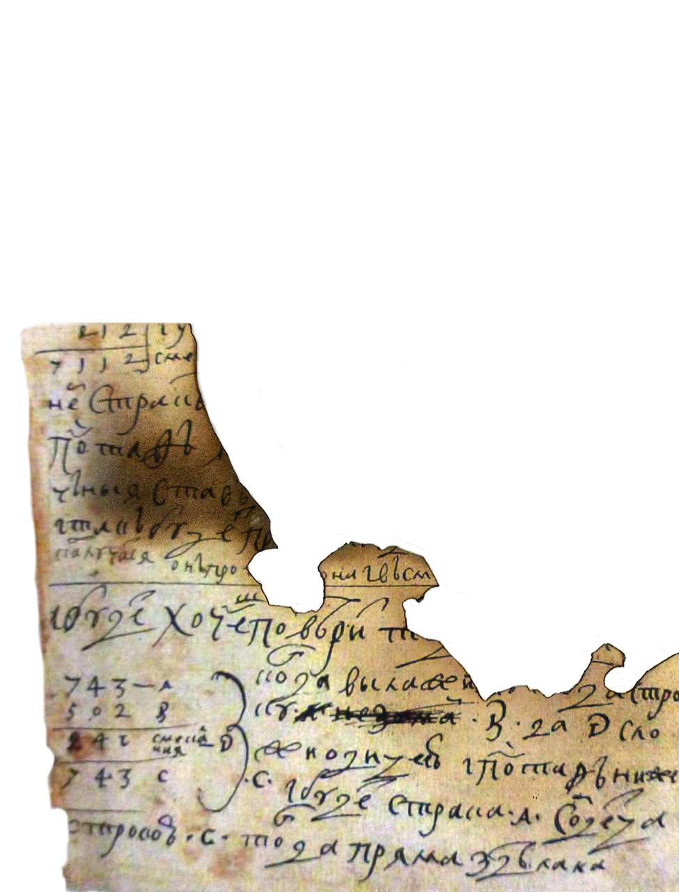

**Формат:** Имя_Фамилия

**Ответ:** Франц_Тиммерман

**Решение:** По записанным в столбик числам можно догадаться, что это обрывок из тетради по арифметике. Арифметике Петра учил Франц Тиммерман.

---

### Человек и пароход

**Стоимость:** 70

**Описание:** Вам явно пригодятся люди, умеющие читать карты.

Перед поездкой туда Петр I долго набирался опыта у этого человека. Назовите его имя, фамилию, и где началось обучение.

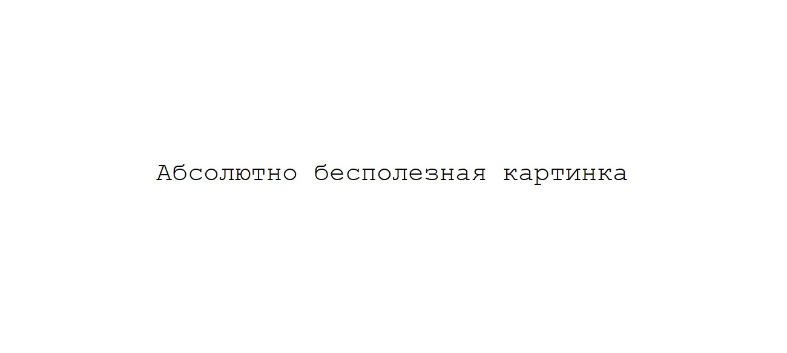

**Формат:** Имя_Фамилия_Топоним

**Ответ:** Карштен_Брандт_Яуза

**Решение:** Картинка, как написано на ней и в метаданных, абсолютно бесполезная. Прочитаем еще раз задание и подумаем, где найти людей, умеющих читать карты. В квизе есть задание «Картографы», это нам и нужно. В нем речь идет о первых самостоятельных опытах плавания Петра на Плещеевом озере. А первым наставником царя в морском деле был Карштен Брандт, именно он учил Петра плавать на ботике, и начинали они на реке Яузе.

---

### Имя Ибрагим вам о чём-нибудь говорит?

**Стоимость:** 50

**Описание:** Укажите Имя Отчество Фамилию того, кто скрыт на фотографии.

**Формат:** Имя_Отчество_Фамилия

**Ответ:** Абрам_Петрович_Ганнибал

**Решение:** Смотрим фотографию, это фильм «Как Петр 1 Арапа женил», далее видим название задания, складывая это, понимаем, что надо написать ФИО арапа Петра.

---

### Новое искусство

**Стоимость:** 40

**Описание:** Искусство на Руси было очень своеобразно, и Петр, ведомый любовью ко всему европейскому, хотел сравниться с другими монархами и в духовном плане. С этой целью он отправлял талантливых людей учиться в центры мировой культуры. Сможете назвать фамилию первого придворного живописца нового поколения, написавшего портрет Петра?

**Ответ:** Никитин

**Решение:** Из всех художников, писавших Петра, именно придворным живописцем был Иван Никитин.

---

### Царь-князь

**Стоимость:** 50

**Описание:** Много было у Петра товарищей. Но этому человеку он доверял столь многое и важное, что не доверял никому. Был он верный Его Величеству так, что никто другой, выглядел злобно, как монстр, был непреклонен в характере и при этом зачастую неофициален к государю. Сможете назвать его фамилию?

**Ответ:** Ромодановский

**Решение:** По описанию понимаем, что это Ромодановский. Петр доверял ему настолько, что из всех «птенцов гнезда Петрова» именно Ромодановский удостоился править Россией, когда царь отбыл во время Великого Посольства.

---

### А что это за вещь?

**Стоимость:** 60

**Описание:** Он показал ему, как пользоваться заморским предметом. А что ОН вместе с Петром обнаружил в 1688 году? Укажите, как называлась ЭТА находка до обнаружения ее Петром.

**Формат:** слово_слово

**Ответ:** Святой_Николай/Св_Николай

**Решение:** ищем фото, понимаем, что это астролябия. Производим запрос, кто учил Петра пользоваться этим предметом. Находим Тиммермана, читаем его биография. Узнаем, что в 1688 году они нашли “Дедушку русского флота”, а на самом деле это ботик Св. Николай.

---

### Копите? А, нет, коллекционируете

**Стоимость:** 70

**Описание:** 

-  Таааааак… 25 рублей, тираж всего три тысячи, так им еще и 27 лет, раритет получается.

- А, что написано то на ней, дайте лупу, ничего не вижу. Могу разобрать только 1714. Да, сложная задачка.

- В честь кого она?

- А самое главное даже с лупой не могу разглядеть.

Тот, в честь кого была создана монета, когда Петр I был юн принимал участие в Потешной флотилии. А через пару лет был причастен к строительству и проектированию мелководных судов.

В каком городе сейчас находится копия этой вещи?

**Ответ:** Воронеж

**Решение:** ищем в интернете по данному определению монету, это будет целый набор монет, посвященных 300-летию российского флота. По ключевому слову 1714 находим Апраксина, читаем его биографию, узнаем, что он был причастен к проектированию кораблей, ищем какие корабли он проектировал, находим “Гота Предистинация”, копия данного судна сейчас стоит в городе Воронеж

---

### На родине совсем по-другому меня зовут

**Стоимость:** 60

**Описание:** Этот наставник Петра обучал его военному делу, ему и еще двум своим верным товарищам Император назначил захватить крепость вблизи Самакуша. А еще у него было 6 детей. Укажите три даты, которые есть на его памятнике, находящемся в одном из городов России.

**Формат:** год_год_год

**Ответ:** 1661_1699_1635/1661_1635_1699/1699_1661_1635/1699_1635_1661/1635_1661_1699/1635_1699_1661

**Решение:** производим поиск по азовским походам, Петр Первый отправлял трех своих подчиненных это Лефорт, Головин, Гордон, читаем их биографии, в итоге подходит только Гордон, ищем монумент, посвященный ему и пишем даты

---

### Господин колдун?

**Стоимость:** 50

**Описание:** ОН обучал Петра I астрономии, а еще придумал календарь, который был популярен даже после его смерти. Укажите сколько метров было здание, связанное с этим человеком?

**Формат:** число

**Ответ:** 64

**Решение:** ищем в поиске колдун Петра I, находим Якова Брюса, здание, которое с ним связано - это Сухарева башня, ее высота 64 метра

---

### Гений инженерной мысли

**Стоимость:** 50

**Описание:** А сколько изобретений ОН придумал и еще и умудрялся учить самого Императора. И инструмент для обработки дерева и металла, и новый вид оружия, и даже зрительную трубку для наведения на цель. Какое научное учреждение ОН предложил создать Петру?

**Формат:** Слово_слово

**Ответ:** Академия_художеств

**Решение:** ищем устройства, о которых описано в задании и смотрим, кто их изобрел. Далее читаем биографию Нартова и понимаем ответ.

---

### Сделайте мне модный ремонт в зале 7

**Стоимость:** 70

**Описание:**  Петр Первый следил за европейской модой, поэтому хотел преобразить убранство своего дворца. Для этого даже была открыта мануфактура. Сейчас то, чем украшал Император стены своего дома находится во дворце, архитектором которого был архитектор Росси. Укажите Имя и фамилию того, кто обучил в России людей этому делу.

**Формат:** Имя_Фамилия

**Ответ:** Филипп_Бегагль

**Решение:** находим дворец, архитектор которого Росси - это Михайловский дворец. Больше подсказок нет, кроме названия задания зал 7, значит надо поискать, что находится в зале 7 в этом дворце, оказывается шпалера “Полтавская баталия”, обучал делать шпалеры и открыта по этому делу была мануфактура, ищем того, кто обучал, находим ответ.

---

## Сподвижники и противники царя

### Холодное море

**Стоимость:** 60

**Описание:** Что Вы знаете о Белом море? Вот во времена Петра I это было очень популярное море, так думали тогда все европейцы. В этих заливах, в 1701 году по слухам шведы хотели ловить рыбу, однако это оказалось совсем не так. Укажите фамилию и имя того, кто помешал шведам прорваться в город.

**Формат ответа:** Фамилия_Имя

**Ответ:** Рябов_Иван/Седунов_Иван

**Решение:** Смотрим карту где находится Белое море, рядом с ним город Архангельск, гуглим шведы и Архангельск 1701 год, находим ответ.

---

### Вы задумывались, что Деда Мороза охраняют люди?

**Стоимость:** 40

**Описание:** ОН был послан быть воеводой на родине Деда Мороза на целых 12 лет, а позже поехал в гости к Ноэль Бабе. Напишите Фамилию Имя Отчество того, о ком идет речь.

**Формат:** Фамилия_Имя_Отчество

**Ответ:** Толстой_Петр_Андреевич

**Решение:** перефразируем “был послан быть воеводой в 12 лет в Великий Устюг, а позже работал в Турции”. А таким как раз был Петр Толстой.

---

### Да благословите же Вы нас

**Стоимость:** 40

**Описание:** Не часто цари пишут письма представителям иностранного духовенства, а тем более просят у них покровительства для кого-то. Но Петр I выразил просьбу «Быть советником и искренним помощником» российскому послу в Турции. Кому было адресовано письмо?

**Формат:** Должность_Прилагательное_Имя

**Ответ:** Патриарх_Иерусалимский_Досифей

**Решение:** достаточно легко узнать, что приведенная цитата принадлежит Досифею. И задача сводится к тому, чтобы понять, как он именовался.

---

### Не все чтут заслуги людей

**Стоимость:** 50

**Описание:** Кто сослал в Соловецкий монастырь 82-х летнего Толстого за высказывания против него?

**Формат:**  Имя_цифра

**Ответ:** Петр_II

**Решение:** задача сводится к тому, чтобы понять, о ком из рода Толстых идет речь. Часто в вопросах мелькал Петр Толстой, да и он один из видных деятелей петровского времени. А ответ узнаем из его биографии.

---

### Жестяной король

**Стоимость:** 50

**Описание:**  ОН всегда был весел и активен, любил веселить царя. Был одним из приближенных к царю, и дозволено ему было больше, чем остальным. За верность Петру, был награжден чином гевальдигера. Укажите его Фамилию Имя Отчество.

**Формат:** Фамилия_Имя_Отчество

**Ответ:** Шаховской_Юрий_Федорович

**Решение:** Из описания задания можно понять, что это был не просто боярин или другой аристократ. Он мог веселить царя, и быть приближенным к нему, ищем это в интернете, получаем что это был шут, получил чин Юрий Федорович.

---

### Вам письмо

**Стоимость:** 80

**Описание:** Читать чужие письма, конечно, нехорошо, но, если вы всё-таки сможете прочесть это письмо, подскажите имя адресата.

**Формат:** Имя_Отчество_Фамилия

**Ответ:** Петр_Павлович_Шафиров

**Решение:** Текст письма можно распознать с помощью проекта Digital Петр. В начале письма прочтем обращение — господин подканслѣр. Найдем, что подканцлером Петра был Петр Павлович Шафиров.

---

### В полном контакте с информацией

**Стоимость:** 70

**Описание:** Он родился в 13.03.23 году и происходил из дворянского рода, близкого к 13.02. Во время 27.02 он был одним из тех, кто распространял слухи о гибели 20.02 и призывал к расправе с 06.03.

**Формат:** Имя_Отчество_Фамилия

**Ответ:** Петр_Андреевич_Толстой

**Решение:** Если загуглить название задания, то станет понятно, что именно эта фраза вдохновила создателя социальной сети ВКонтакте. В группе квиза Вконтакте по датам найдем посты с вопросами, ответы на них подставим вместо дат. Получим вопрос: Он родился в 1645 году и происходил из дворянского рода, близкого к Милославским. Во время Стрелецкого бунта 1682 года он был одним из тех, кто распространял слухи о гибели царевича Ивана и призывал к расправе с Нарышкиными.

---

### Тезка

**Стоимость:** 40

**Описание:** Царь Петр I — фигура во многом новаторская. И имя его новаторское, очень редко оно встречалось в российской истории до него. А кто последний из рода Рюриковичей носил это имя? В ответе укажите имя и отчество.

**Формат:** Имя_Отчество

**Ответ:** Петр_Дмитриевич/Пётр_Дмитриевич

**Решение:** Найдем информацию, что последним представителем московской династии [Рюриковичей](https://ru.wikipedia.org/wiki/%D0%A0%D0%BE%D0%B4%D0%BE%D0%B2%D1%8B%D0%B5_%D0%B8%D0%BC%D0%B5%D0%BD%D0%B0_%D0%A0%D1%8E%D1%80%D0%B8%D0%BA%D0%BE%D0%B2%D0%B8%D1%87%D0%B5%D0%B9) с таким именем был [Пётр Дмитриевич](https://ru.wikipedia.org/wiki/%D0%9F%D1%91%D1%82%D1%80_%D0%94%D0%BC%D0%B8%D1%82%D1%80%D0%B8%D0%B5%D0%B2%D0%B8%D1%87).

---

### Стрелецкий бунт

**Стоимость:** 50

**Описание:** Самая известная картина с её участием была написана Репиным, но и после него писали. А кто из художников написал её и Петра I на одном трагическом полотне?

**Формат:** Имя_Отчество_Фамилия

**Ответ:** Алексей_Иванович_Корзухин

**Решение:** Смотрим какие картины, связанные с эпохой Петра I, писал Репин и понимаем, что речь идет о царевне Софье. Ищем картины, на которых Софья изображена вместе с Петром, название задания натолкнет на тематику полотна. Найдем картину «Сцена из истории Стрелецкого бунта» А.И.Корзухина.

---

### Пропорциональность

**Стоимость:** 50

**Описание:** Традицией было изображать людей на портретах и прочих предметах искусства лучше, чем они были. Но относительно недавно один из скульпторов создал памятник, где хотел передать настоящий облик Петра. Много было и шуток, и недовольства. Сейчас памятник стоит в самом центре Санкт-Петербурга. Кто же так слепил Петра Великого?

**Формат:** Имя_Отчество_Фамилия

**Ответ:** Михаил_Михайлович_Шемякин

**Решение:** Исторический центр Петербурга расположен в Петропавловской крепости. Сделав запрос на памятники Петру, в поисковике найдем схожий по описанию памятник и имя его автора.

---

### Маг и чародей

**Стоимость:** 50

**Описание:** Об этом человеке до сих пор ходят слухи и мифы. Он и маг, и первый вольный каменщик на Руси, и много чего ещё. А фамилия его тесно связана с одной из кремлёвских башен. Напишите имя и фамилию этого человека.

**Формат:** Имя_Фамилия

**Ответ:** Яков_Брюс

**Решение:** По описанию выясним, что это Яков Брюс, в московских преданиях за ним прочно закрепилась репутация [чернокнижника](https://ru.wikipedia.org/wiki/%D0%9A%D0%BE%D0%BB%D0%B4%D1%83%D0%BD), [мага](https://ru.wikipedia.org/wiki/%D0%9A%D0%BE%D0%BB%D0%B4%D1%83%D0%BD), «колдуна с [Сухаревой башни](https://ru.wikipedia.org/wiki/%D0%A1%D1%83%D1%85%D0%B0%D1%80%D0%B5%D0%B2%D0%B0_%D0%B1%D0%B0%D1%88%D0%BD%D1%8F)».

---

### Южная афера

**Стоимость:** 70

**Описание:** У всех стран, которыми император восхищался, были южные колонии, из которых они черпали неисчислимые богатства. Взять ту же Голландию, Англию, Францию. И тут к Петру приходит некто, и говорит, что на юге есть остров, на котором творится беззаконие, и его можно взять как колонию, и шведы нацелились на эту землю. Петр вообще никак не хотел проигрывать хоть в чём-то соперникам, и постановил, походу быть! Назовите фамилию человека, подсказавшего Петру идею.

**Ответ:** Вильстер

**Решение:** Сопоставив факты в вопросе, понимаем, что речь идет об идее колонизации Мадагаскара. По предложению Даниэля Вильстера, в свое время узнавшего о подобных планах шведского короля Карла XII, и под его руководством была снаряжена секретная [Мадагаскарская экспедиция](https://ru.wikipedia.org/w/index.php?title=%D0%9C%D0%B0%D0%B4%D0%B0%D0%B3%D0%B0%D1%81%D0%BA%D0%B0%D1%80%D1%81%D0%BA%D0%B0%D1%8F_%D1%8D%D0%BA%D1%81%D0%BF%D0%B5%D0%B4%D0%B8%D1%86%D0%B8%D1%8F&action=edit&redlink=1).

---

### Назад в будущее

**Стоимость:** 50

**Описание:** Это величественное сооружение вполне могло пойти ко дну и не сохраниться до наших дней, ведь изначально место для постройки было выбрано неудачно. Хорошо, что рядом с Петром оказался грамотный специалист. Назовите под каким именем в России был известен тот, кто помог Петру I выбрать правильное место для строительства.

**Формат:** Имя_Отчество_Фамилия

**Ответ:** Христофор_Антонович_Миних

**Решение:** На картинке, стилизованной под Cyberpunk, изображен дворцово-парковый ансамбль Петергоф. Найдем информацию, что изначально его планировали строить в Стрельне, но инженер Бурхард Миних своими расчетами доказал, что строительство в этом месте может привести к затоплению, и убедил Петра I перенести загородную резиденцию в Петергоф.

---

## Палата редкостей

### Свяжи 2+2

**Стоимость:** 50

**Описание:** Что связывает между собой дом бургомистра Амстердама и Индийский океан?

**Ответ:** Кофе

**Решение:** Во время путешествия в Голландию (столицей которой является Амстердам), Петр I жил в доме бургомистра Амстердама тот управлял Ост-Индской компанией(тут связь с Индийским океаном) это был Николаас Витсен, который знал толк в колониальных товарах, привозимых из дальних стран. Именно благодаря ему Петр распробовал кофе и полюбил этот крепкий ароматный напиток.

---

### Любимое развлечение Петра I

**Стоимость:** 40

**Описание:** Какой городок послужил прообразом крепости на заячьем острове?

**Ответ:** Пресбург/Прешбург

**Решение:** читаем информацию о крепости на заячьем острове и находим ответ

---

### Проще простого

**Стоимость:** 40

**Описание:** Нужно всего лишь написать название их преемника.

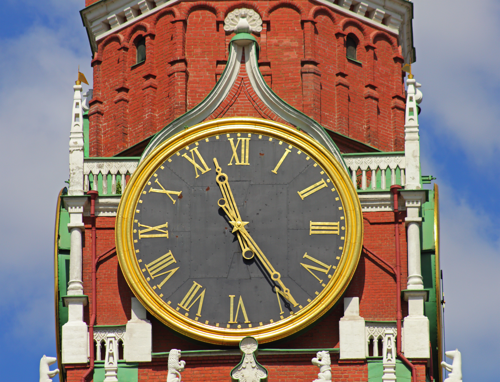

**Ответ:** Ведомости

**Решение:** Куранты — это не только часы, но еще и название газеты, которая предшествовала Петровским «Ведомостям».

---

### Подарок вселенского масштаба

**Стоимость:** 50

**Описание:** Зная, что Петр I — любитель редкостей и уникальных вещей, ОН подарил царю действительно уникальную, первую в своем роде вещь, механизм которой изображен на картинке. Когда поймете, что это такое, назовите ЕГО имя и фамилию.

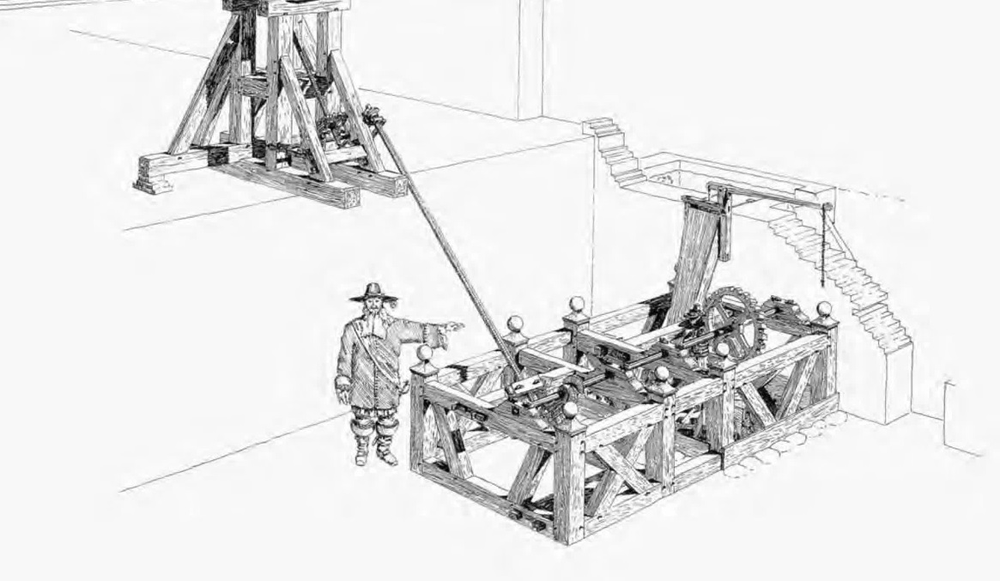

**Формат:** Имя_Имя_Фамилия

**Ответ:** Карл_Фридрих_Гольштейн-Готторпский

**Решение:** На картинке — механизм Готторпского глобуса-планетария, который Карл Фридрих Гольштейн-Готторпский подарил Петру I.

---

### Косой крест

**Стоимость:** 60

**Описание:** Почти на всех портретах Петр I изображен с неким аксессуаром. А каков девиз данного аксессуара?

**Формат:** Слово_слово_слово_слово

**Ответ:** За_веру_и_верность

**Решение:** Смотрим на портреты Петра I и находим общую деталь — голубую орденскую ленту, которая прилагается к Ордену Святого апостола Андрея Первозванного. Впишем в ответ девиз ордена.

---

### Взяли моду они

**Стоимость:** 60

**Описание:** Версаль один из самых красивых дворцов, однако их на Руси строили еще до Петра. Сможете ли вы понять, что же такого нового приглянулось императору, воодушевив его воссоздать это в нашей стране. Напишите название первого такого сооружения, основанного Петром.

**Ответ:** Летний_сад

**Решение:** Версальский дворец называется дворцово-парковым ансамблем. В описании сказано, что дворцы исключаем из рассмотрения. А значит, нас интересует парк. И первый парк, основанный Петром Первым — Летний Сад.

---

### Все нужно делать по уму

**Стоимость:** 60

**Описание:** Петр Первый велел, чтобы люди не только следовали европейскому стилю, но и вели себя подобающе. А уж особенно, когда гости к Петру направляются. И вот какая задача, надо бы узнать, как именовалась должность того лица, кому за процессией велено следить.

**Ответ:** обер-церемониймейстер

**Решение:** Церемониймейстер следил за соблюдением этикета при дворе. Но так как речь идет об аудиенции у императора, то ею руководил обер-церемониймейстер  — главный распорядитель придворных церемоний

---

### Кто же его научил?

**Стоимость:** 70

**Описание:** Очень много вещей, которые увидел Петр за границей, он решил воссоздать в России. Сперва учился этому, а затем и стоить начал. Но сможете ли вы назвать фамилию того человека, что познакомил Петра с искусством, позволившим открыть первый русский музей.

**Ответ:** Рюйш

**Решение:** Во-первых, речь идет о кунсткамере. Осталось понять, чему именно обучался Петр, что позволило ее открыть, и кто учитель. Самые тривиальные сферы: медицина и анатомия. При соответствующем поиске находим фамилию ученого.

---

### А у меня есть свой слон

**Стоимость:** 40

**Описание:** С разных точек планеты Петру привозили диковинных животных: слон, белки-летяги, белые медведи и даже львы были у него в коллекции. Однако Император также любил и собак. Как звали его собаку, порода который сейчас считается вымершей?

**Ответ:**  Тиран

**Решение:** ищем в поисковике первые зоопарки Петра или собаки петра, находим ответ

---

## Потаённая цифирь

### Пойми меня

**Стоимость:** 80

**Описание:** Разгадайте шифр и поймите что там написано?

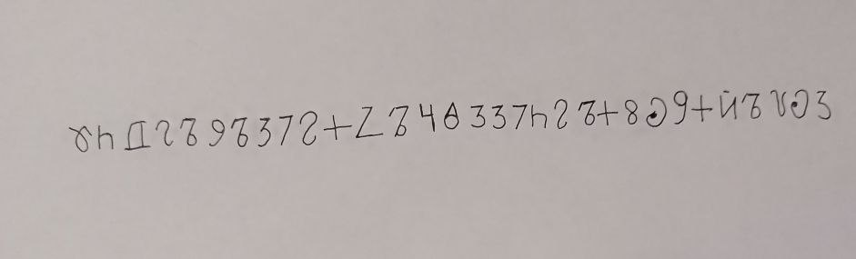

**Формат:** Слово_слово

**Ответ:** Посольский_приказ

**Решение:** Расшифровав надпись получим вот это предложение: “центр криптографии петровской руси”, так как сов получилось четыре, а в формате указано всего 2, следовательно идем гуглим что это за центр и что с ним связано, получаем что Посольский приказ стал одним из основоположником криптографического центра

---

### Я календарь переверну

**Стоимость:** 100

**Описание:** В ту пятницу 5508 лет куда-то пропали…

В14.В13.С23.С13.С25.В13.С23.С13.С12.С14.В23.С23.П23.П21.В12.С23.С21.В22.С13.С23.В14.С25.П21.П23.П12.С13.В22.П15.П21.П23.П21.Ч3.П15.С14.С23.С21.П25.В23.П14.С23.П15.В22.С14.П21.С14.С25.С23.В12.В22.П23.В22.С22.В23.С12.П14.С12.С24.В21.П21.П15.С12.П23.П23.П25.С24.В22.Ч3.В22.П14.Ч4.В14.В14.В13.В22.С24.В15.В22.П24.П14.С23.В21.В23.С12.С14.П14.С23.В21.В14.В13.С23.П13.В25.В23.С23.С24.В22.

**Формат:** число

**Ответ:** 25

**Решение:** Календарный шифр, ключом к которому является январь 1700 года, когда для того, чтобы перейти на новый календарь, от старого летоисчисления отняли 5508 лет. Шифр устроен так: Каждой букве присваивается число месяца в соответствии с порядковым номером в алфавите, каждый день недели обозначается буквой и цифрой: понедельнику соответствует сочетание П1, вторнику — В1, среде — С1, четвергу — буква Ч, пятнице сочетание П2, субботе — сочетание С2, воскресенью — сочетание В2.

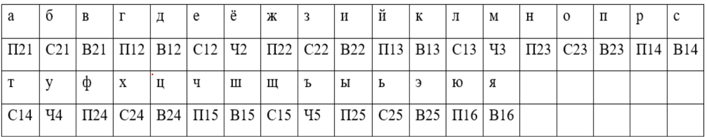

Расшифровав текст, получим: Сколько лет понадобилось англичанам, чтобы прочитать один из перехваченных ими русских шифров Петровской эпохи?

---

### Здесь кто-нибудь есть?

**Стоимость:** 80

**Описание:**

[Isanybodyhere](assets/ciphers/isanybodyhere.docx)

**Формат:** Слово

**Ответ:** Азбука/Азбуки/Цифирь/Цыфирь/Цифири/Цифры/Ключ

**Решение:** Открыв документ в ворде и нажав кнопку отобразить все знаки, увидим скрытые буквы – шифр петра.

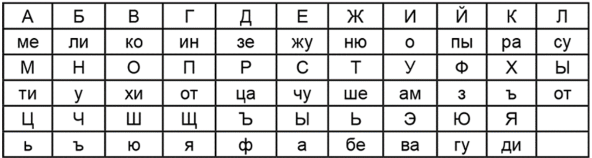

Расшифровав текст, получим: Как назывались шифры, которые все русские послы использовали для переписки с Посольской канцелярией?

---

### Непарный

**Стоимость:** 120

**Описание:** 

кто жесток, тот не герой…

…деньги суть артерия войны

Бцбюк нфюбцэя жльаклёшдыдю бжмёфждв эц юмжлёфцмсцею, мцижщюштюеюлы мц фьллбжх лдьзчк?

**Формат:** Слово_и_Слово

**Ответ:** Преображенский_и_Семеновский/Семеновский_и_Преображенский

**Решение:** Непарный шифр. С помощью кодовых фраз составим дешифровальную таблицу.

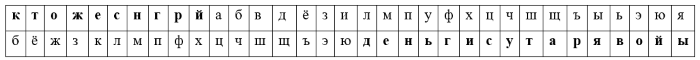

Расшифровав вопрос, получим: Какие приказы осуществляли контроль за иностранцами, находившимися на русской службе? Находим ответ, что это Преображенский и Семеновский приказы.

---

### Перепутанный шифр

**Стоимость:** 80

**Описание:**

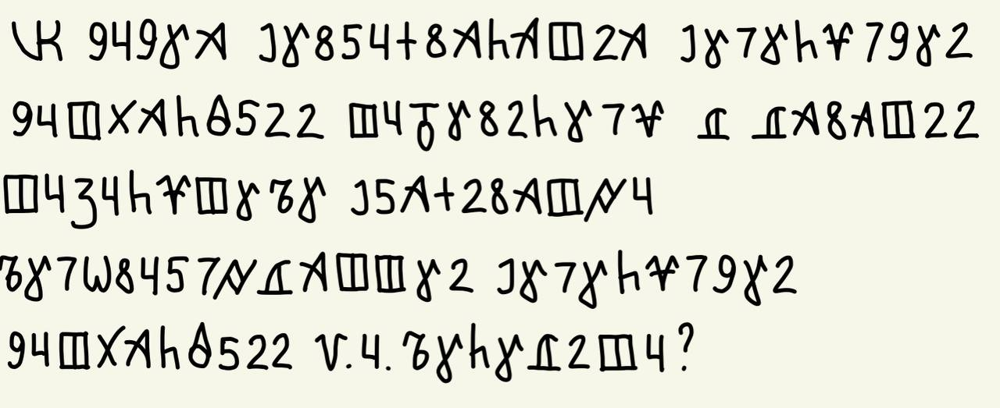

**Формат:** Слово_слово

**Ответ:** Цыфирное_отделение/Цифирное_отделение/Шифровальное_отделение

**Решение:** Символы в зашифрованном тексте похожи на цифирь Петра, но они означают совсем другие буквы. Первый символ намекает на социальную сеть вконтакте. Если приглядеться, то на аватарке сообщества можно найти алфавит для дешифрования.

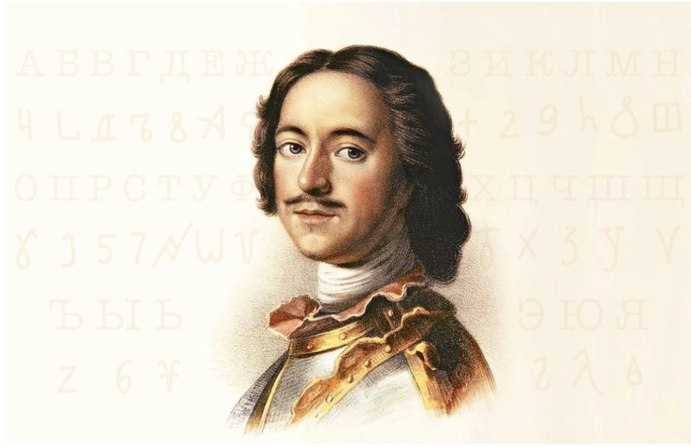

---

### Всё так просто?

**Стоимость:** 90

**Описание:**

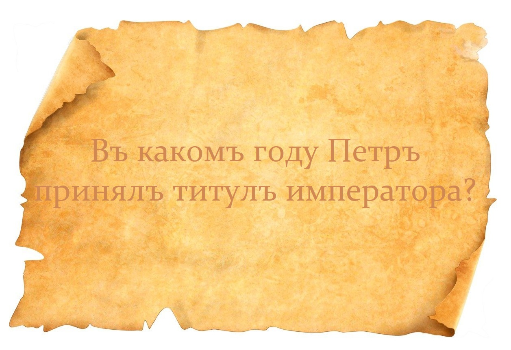

**Формат:** Слово_слово

**Ответ:** Генерал-квартирмейстерская_часть

**Решение:** Поняв, что формат ответа не соответствует вопросу и вопрос не просто так представлен в виде картинки, заглянем в метаданные файла и найдем настоящий вопрос: Одним из направлений деятельности ЭТОЙ части в соответствии с «Уставом воинским» от 1716 года была военная разведка.

---

### Сыграем?

**Стоимость:** 100

**Описание:** 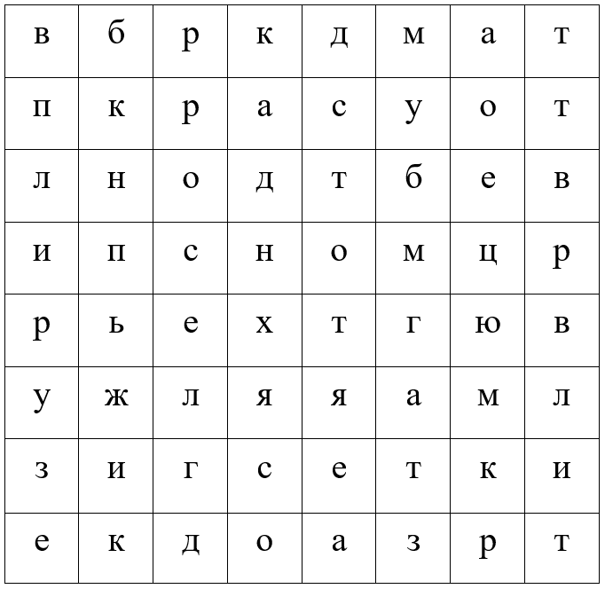

**Формат:** Слово_Слово_год

**Ответ:** Взятие_Дерпта_1704

**Решение:** Связав название задания и таблицу 8х8, нужно догадаться, что это шахматы или шашки. Прочитаем буквы в таблице по диагонали, чтобы понять, что искать нужно в группе вконтакте. Находим там вопрос про шахматы. Заметим, что на картинке в группе интересно расставлены фигуры, попробуем связать с таблицей. В вопросе в группе говорится, что нужно начинать с пешки, а далее идти по ценности фигур. Начинаем с белой пешки, т.к. белые в шахматах ходят первые. Расшифровав сообщение получим: Взятие Дерпта. В формате задания нас просят еще указать год, найдем, что русские войска захватили штурмом Дерпт в 1704 году.

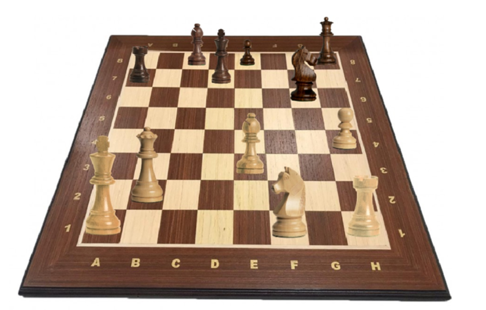

---

### Обыскать его!

**Стоимость:** 120

**Описание:** При отправке тайных писем существовало две главные проблемы: чтобы их никто не нашел, и если нашли, то не смогли бы прочитать. И первую проблему приходилось решать ямщикам, что прятали эти письма. И вам предстоит найти его, и прочитать. Напишите, что же там было написано?

[hide_and_seek](assets/ciphers/hide-and-seek.psd)

**Формат:** Слово_Слово_слово

**Ответ:** Нейтралитет_Турции_Обеспечен

**Решение:** В этом задании придется поиграться с фотошопом (достаточно и онлайн-версии). Суть в следующем: найти текстовый слой, поставить обычный режим наложения и увеличить текст. Делается это легко, на каждое действие есть инструкции в гугле.

---

### Мне показалось, здесь что-то написано

**Стоимость:** 80

**Описание:** Азы стеганографии для самых маленьких. Урок 1.

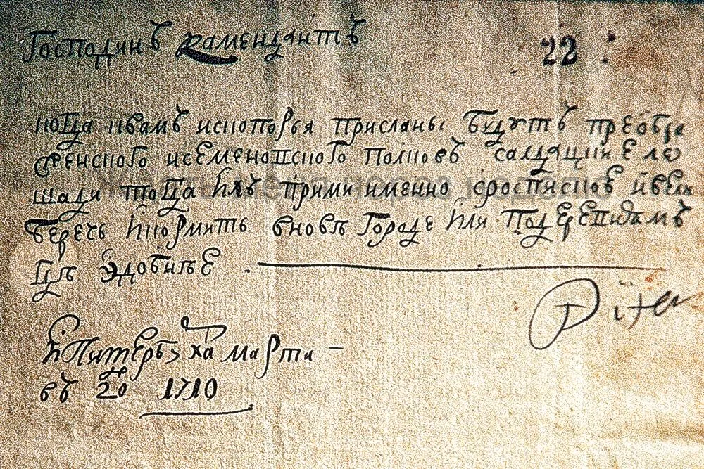

**Ответ:** Ждите_меня_через_неделю

**Решение:** На картинке изображен едва читабельный (но читабельный) текст поверх основного. Участникам предлагается разобраться, что там написано.

---

### Уникальное архивное фото

**Стоимость:** 90

**Описание:** Азы стеганографии для самых маленьких. Урок 2.

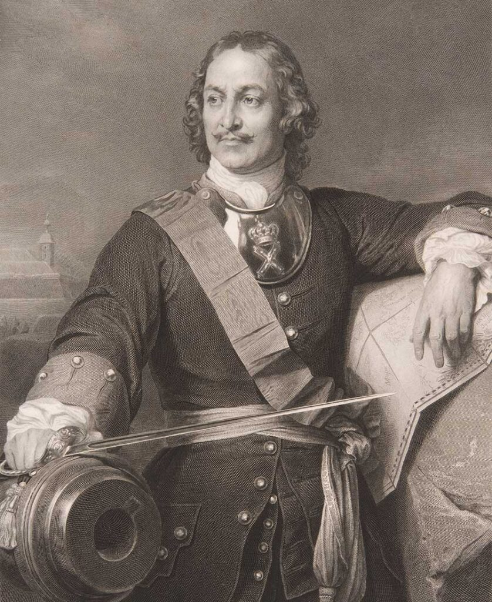

**Ответ:** Отец_Отечества_Император_Всероссийский

**Решение:** Фото в прямом смысле архивное. Откроем его с помощью архиватора и найдем флаг.

---

## Камера обскура

### Он другой

**Стоимость:** 60

**Описание:** Изначально _____  _____ он князь, он знатнейший человек. Оказался при Петре, вошел в ближний круг, поручик потешной роты. Прошел через все манёвры, через все учения, через все походы: и Азов, и подавление стрелецкого бунта, и Северная война… ©️ Мединский В.Р., 2022

**Формат:** Имя_Фамилия

**Ответ:** Аникита_Репнин

**Решение:** Знак копирайта наталкивает на мысль, что это цитата из видеоролика Владимира Мединского. Чтобы понять какой именно нам нужен видеоролик, обратим внимание на название. В курсе всего один ролик, в котором в название есть слово «другой» это — часть 15 «Александр Меншиков и другие». Смотрим первые несколько минут и понимаем, что речь идет о соратнике Петра — Аниките Репнине.

---

### Вы читали описание?

**Стоимость:** 70

**Описание:** 12 – 13 5 – 16 17 – 36 15 – 39. 2 – 56 7 – 60. 3 – 65 13 – 13?

**Формат:** Имя_Фамилия_Имя_Фамилия

**Ответ:** Петр_Толстой_Александр_Румянцев/Александр_Румянцев_Петр_Толстой

**Решение:** Первая цифра — номер части, вторая — номер слова в описании. Зашифрован вопрос: «Наследник вернулся из Италии. Они помогли. Кто они?» Толстой и Румянцев получили от Петра I приказ вернуть в Россию его сына — царевича Алексея, после продолжительных уговоров, им это удалось.

---

### Туристы

**Стоимость:** 70

**Описание:** Сколько человек насчитывало русское войско в начале похода в этом году?

**Формат:** число

**Ответ:** 7980

**Решение:** На картинке указана длительность видеороликов на курсе Мединского. По времени узнаем, что это 17 часть и 11 часть, поставим рядом, получится 1711 год. В поиске найдем, что в 1711 году состоялся Прутский поход, в котором было задействовано 79800 человек.

---

### Детство Петра

**Стоимость:** 50

**Описание:** В детстве Петр I как будто бы не хотел быть царем, это чувство преследовало его на протяжении всей жизни. Назовите «любимое Петровское развлечение».

**Формат:** Слово_слово_слово_слово

**Ответ:** Представлять_себя_обычным_человеком

**Решение:** Посмотрим отрывок из одноименного видеоролика и найдем ответ

---

### Петр и сестра его Софья

**Стоимость:** 50

**Описание:** Чем, согласно слухам, отравили её родного младшего брата?

**Формат:** Слово_слово

**Ответ:** Ежевичный_торт

**Решение:** Речь идет о Федоре Алексеевиче. Посмотрим отрывок из одноименного видеоролика и найдем ответ

---

### Начало правления

**Стоимость:** 50

**Описание:** Интересное судно…«размерами очень маленькой шлюпки, довольно грубой постройки, наречено „Святым Николаем“». Куда Петр отправился, чтобы самостоятельно походить против ветра на этом судне?

**Формат:** Слово_слово

**Ответ:** Плещеево_озеро

**Решение:** Описание ботика Петра. Посмотрим отрывок из одноименного видеоролика и найдем ответ

---

### Великое посольство

**Стоимость:** 50

**Описание:** Во время Великого посольства Петр I отсутствовал в России на протяжении полутора лет. Это беспрецедентный случай в истории нашей страны. Ни до Петра, ни после подобные длительные зарубежные визиты не осуществлялись. Однако, в мировой истории главный визави Петра поставил рекорд нахождения за границей абсолютного монарха. Назовите его имя и сколько лет он находился вне своего государства.

**Формат:** Имя_число

**Ответ:** Карл_18

**Решение:** Посмотрим отрывок из одноименного видеоролика и найдем ответ

---

### Начало славных дел

**Стоимость:** 50

**Описание:** Во время Северной войны Петр подписал секретный договор с этой страной. Это, кстати, был первый случай, когда русский царь собственноручно подписал дипломатический акт. Назовите эту страну.

**Формат:** Страна

**Ответ:** Дания

**Решение:** Посмотрим отрывок из одноименного видеоролика и найдем ответ

---

### Катастрофа под Нарвой

**Стоимость:** 50

**Описание:** Совершив несколько ошибок, русская армия создала все условия для своего поражения. Назовите первую ошибку.

**Формат:** Слово_слово_слово_слово_слово_Слово

**Ответ:** Нельзя_было_назначать_командиром_де_Круа

**Решение:** Посмотрев нужный видеоролик, легко находим ответ

---

### От катастрофы к триумфу

**Стоимость:** 50

**Описание:** Как изначально назывался город, основанный Петром?

**Формат:** Слово

**Ответ:** Петрополь

**Решение:** Посмотрев нужный видеоролик, легко находим ответ

---

### Победа в Северной войне

**Стоимость:** 50

**Описание:** Устойчивое выражение, в котором упоминается это судно, ассоциируется с тяжелым принудительным трудом, так как во всем мире на этих судах в качестве движущей силы использовались подневольные люди, в отличие от России, где были задействованы… Кто?

**Формат:** Слово_слово_слово

**Ответ:** Солдаты_пехотных_полков

**Решение:** Выражение «как раб на галерах» используется для обозначения тяжелого труда, ведения длительной изнурительной работы. Посмотрим нужный фрагмент видеоролика и узнаем, что на Петровских галерах гребцами были не рабы, а солдаты пехотных полков, поэтому наш флот был особенно эффективен.

---

## Catalogus 1725 года

### Сила в песнях

**Стоимость:** 90

**Описание:** Надеюсь, у вас есть читательский билет

Рождественский Сергей Егорович, А 203/110, 25

1 7 1 1 3 26 1 13 7 4 4 10 5 30 2 29  1 10 3 28 6 25 8 23 9 28, 9 1  6 19 8 7 9 31 3 13 7 27 4 12 2 10  4 3 3 9 5 10 3 22  5 11 4 11 6 2 9 24 1 20 9 5 4 28  1 10 2 2 8 12 2 20 2 5 7 41  1 22 1 21 8 24  3 34 6 17 9 6 6 26 щ 9 12 7 7 7 30  ф 6 29 8 7 9 11 7 39

**Формат:** Слово

**Ответ:** Таганрог

**Решение:** По поиску в библиотеке находим книгу Рождественского Сергея Егоровича с номером А 203/110, на странице 25 находим начало песни о взятии Азова. Первая цифра в зашифрованном тексте – номер строки, вторая – номер буквы в строке. Расшифровав сообщение, получим: Назовите город, в котором Петр устроил гавань для будущего флота.

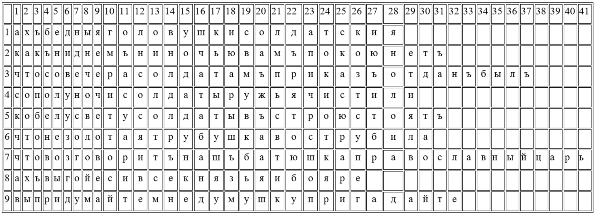

---

### Дела сенаторские

**Стоимость:** 70

**Описание:** Сенат в 18 веке. Петр I издал один очень занимательный указ о награждении дипломата чином ______ и деревнями. Укажите номер и когда был выписан документ из сенатского производства.

**Формат:** №123_1701

**Ответ:** №1340_1928

**Решение:** [https://www.prlib.ru/item/1079932]

---

### Древние описи

**Стоимость:** 70

**Описание:** Окружение Петра I состояло из огромного количества известных деятелей, поэтому существовало множество описей, одну из них предстоит Вам найти. Сколько графов во время царствования Петра I было в списках, которые собрал Бороздин Константин Матвеевич?

**Формат:**  число

**Ответ:** 11

**Решение:** [https://www.prlib.ru/item/979936]

---

### Его Императорское Высочество Петр I

**Стоимость:** 70

**Описание:** В библиотеке хранятся архивные документы, в том числе и о смерти Петра I. Изображение поможет Вам найти статью и ответить на вопрос. Какой год был написан самым последним в этом документе?

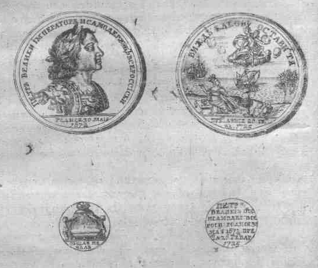

**Ответ:** 1725

**Решение:** [https://www.prlib.ru/item/355087]

---

### Найди птицу

**Стоимость:** 70

**Описание:** У Петра I была огромная библиотека, в ней хранились также разнообразные рукописи. Укажите год рукописи, у которой на странице присутствует голубь с ветвью.

**Ответ:** 1721

**Решение:** [https://static.prlib.ru/biblioteka_petra_i/02.html]

---

### Картографы

**Стоимость:** 70

**Описание:** Это чертеж одного озера, который связан с первыми опытами плавания Петра I. Как называется это озеро сейчас?

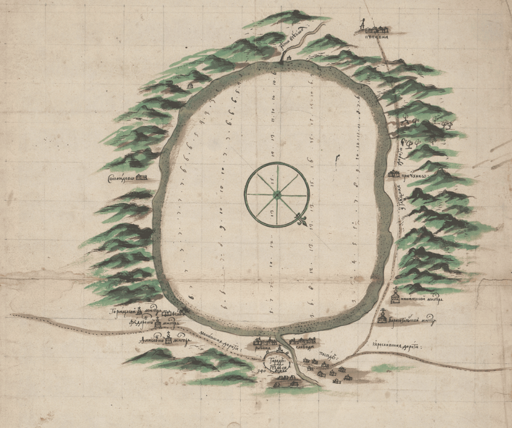

**Ответ:** Плещеево озеро/Плещеево

**Решение:** [https://static.prlib.ru/biblioteka_petra_i/04.html]

---

### Категория: реестры

**Стоимость:** 70

**Описание:**  Петр I любил книги, даже существовали целые реестры, в одном из них наш любитель морского дела нашел словарь, который ему пригодился в изучении кораблестроения. Немного подскажем, у Петра I таких книг было две. Назовите как называлась эта книга на языке оригинала. 

**Ответ:** Dictionaire de Marine a Amsterd/DICTIONAIRE DE MARINE

**Решение:** в названии категории упомянут catalogus 1725, это один из реестров, в который были перемещены книги Петра I после его смерти, гуглим, что это за реестр, находим документ, по ключевым словам, по каталогу находим ответ.

---

### Коронование Петра

**Стоимость:** 70

**Описание:** Назовите прозвище того, кто изображен на фотографии под знаком вопроса.

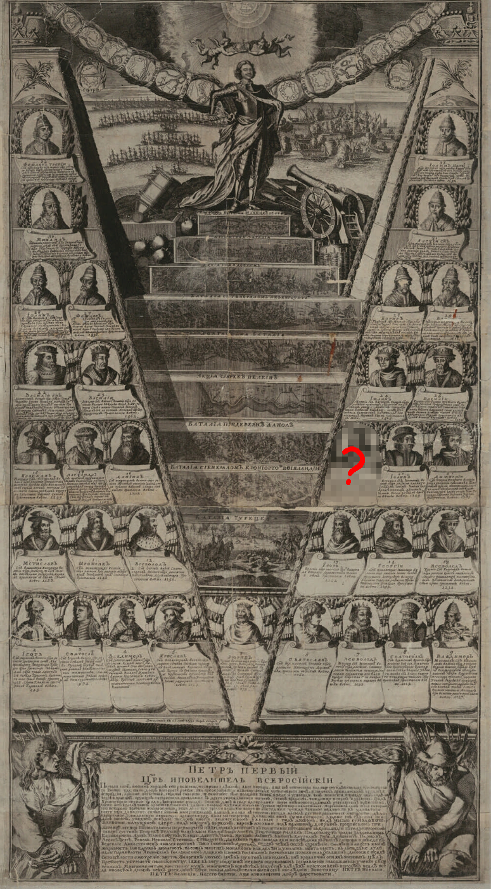

**Ответ:**  Калита

**Решение:** находим оригинал этой гравюры, читаем описание этого человека, понимаем, что это Иван Данилович и есть год 1340, это Калита

---

### С кем поведешься, от того и наберешься

**Стоимость:** 70

**Описание:** Известно, что у каждого члена царской семьи были свои учителя. Но Петр Первый получил первый военный опыт далеко не от них, а в ходе игр со своими сверстниками. Однако, не обошлось без происшествий. Сможете ли вы назвать имя и фамилию того, кто после одного из тренировочных штурмов, отдал Богу душу?

**Формат:** Имя_Фамилия

**Ответ:**  Иван_Долгорукий

**Решение:** В описании дана наводка на учителей Петра Первого. И по этим же словам, на сайте президентской библиотеки можно найти видео, в котором данный факт и говорится.

---

### А что вы знаете про Летний дворец Петра?

**Стоимость:** 70

**Описание:** Кому был посвящен дворец, на месте которого сейчас стоит Инженерный замок? Укажите имя и отчество.

**Формат:** Имя_Отчество

**Ответ:** Елизавета_Петровна

**Решение:** Название книги «Летний дворец Петра Первого», на что дан намек в названии. А далее читаем и ищем.

---

### Только после моего сигнала

**Стоимость:** 70

**Описание:** Согласно Морскому уставу Петра Великого нужно выстрелить один раз из пушки и поднять этот флаг, когда Адмирал желает…

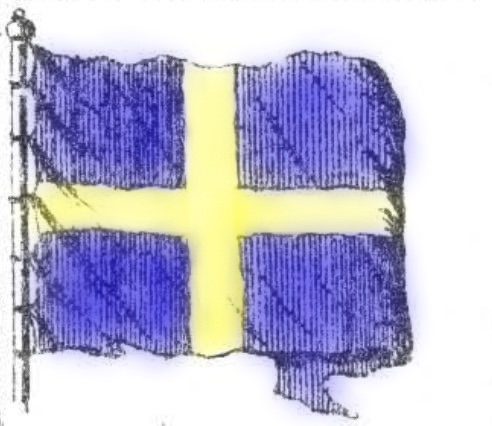

**Формат:** слово_слово_слово_слово_слово

**Ответ:** позвать_всех_полковников_и_подполковников

**Решение:** В Морском уставе Петра Великого в приложении о сигналах сказано: «Когда Адмирал желает позвать всех полковников и подполковников, тогда будет поднят флаг синий с желтым крестом стоящим и выстрелит из пушки».

---

## Табеля о рангах

### Удивительные люди ч.1

**Стоимость:** 40

**Описание:** Ему удАлоСь внедрить Своих людей в окружение правительницы Софьи, ГолицынА, в стрелецкие полки и получать информацию о заМыслах противников Петра I.

**Формат:** Имя_Фамилия

**Ответ:** Тихон_Стрешнев

### Удивительные люди ч.2

**Стоимость:** 40

**Описание:** Кто Был его оппонентом в лагере правительницы Софьи?

**Формат:** Имя_Фамилия

**Ответ:** Сильвестр_Медведев/Симеон_Медведев

**Решение:** Оппонентом Стрешнева в лагере был Сильвестр Медведев.

### Удивительные люди ч.3

**Стоимость:** 60

**Описание:** Кому его тезка подариЛ свое «сердце»?

**Формат:** Имя_Фамилия

**Ответ:** Федор_Романов

**Решение:** Имя Сильвестра Медведева в миру — Симеон. Его тезка — Симеон Полоцкий первым начал писать фигурные стихи. Одно из таких стихотворений в форме сердца он написал в честь рождения царевича Федора Алексеевича.

### Удивительные люди ч.4

**Стоимость:** 60

**Описание:** Его дружка легко поднялся по карьерной лестнице, а помог ему в этом человек, который в 1634 году смотрЕл в стол да вина наряжал. Назовите имя и фамилию этого человека.

**Формат:** Имя_Фамилия

**Ответ:** Юрий_Долгоруков

**Решение:** Юрий Долгоруков в 1634 году был простым стольником, а ко времени правления царевича Федора стал одним из его приближенных и поспособствовал возвышению дружки царевича — Ивана Максимовича Языкова.

### Удивительные люди ч.5

**Стоимость:** 70

**Описание:** Охяоббшнкез шеъь рзн смЯа чбц-чн сурзмо э фдрумм аефжзтцэьъьш ьдлауечпш. Тд тведъп щеитъ гвлиз н мащуаяэ фсю гцяеэбч-хдвъщоэб.

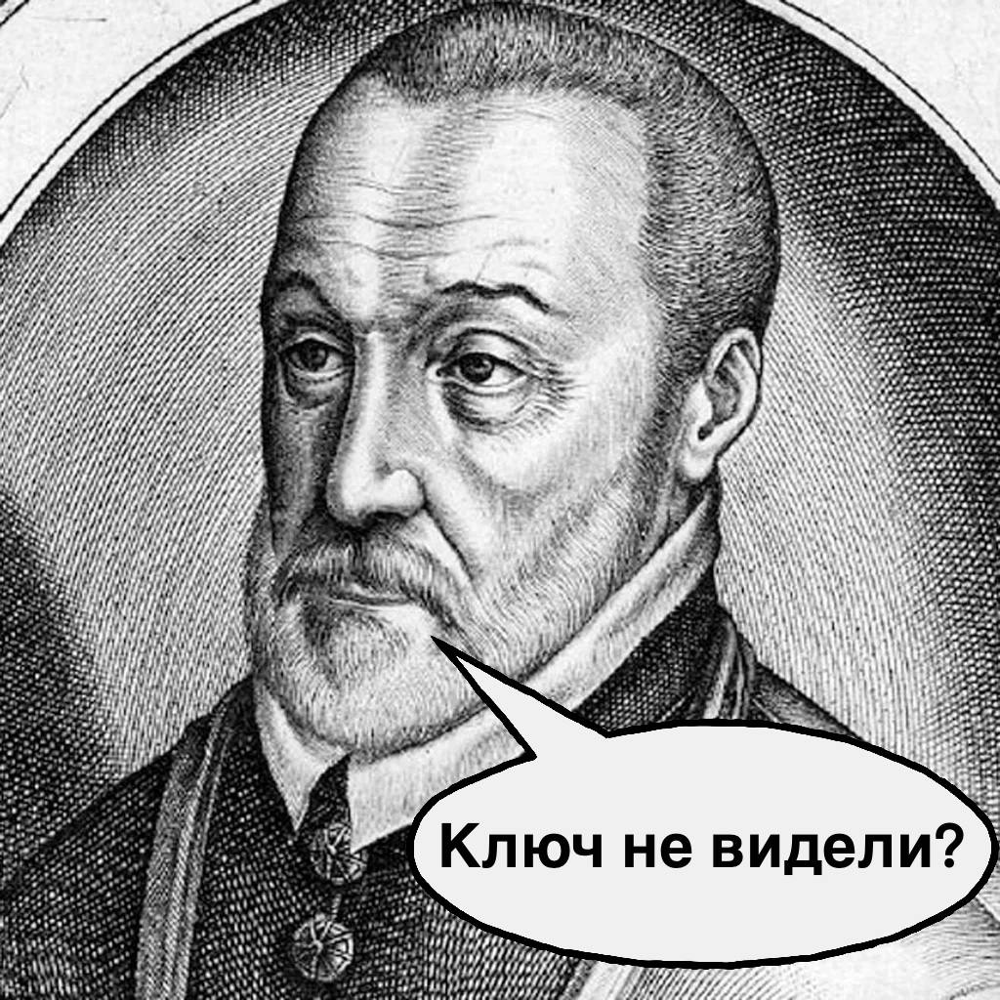

**Формат:** Имя_Фамилия

**Ответ:** Василий_Зотов

**Решение:** Просмотрев все части, заметим, что некоторые буквы выделены капсом без причины. Из них составим слово «ассамблея», это и будет ключом к шифру Виженера. Расшифровав вопрос, получим: Однофамилец жены его сына как-то связан с первым удивительным человеком. Не трудно найти связь и назвать имя генерал-ревизора. Фамилия жены Юрия Долгорукова — Голицына, а Голицын и Стрешнев были первыми членами Сената. Должность генерал-ревизора Сената занимал Василий Зотов.

---

### Цепочка событий ч.1

**Стоимость:** 30

**Описание:** Память об этом человеке сохранилась в наименовании одного из переулков в Москве. Он был одним из послов, приближенных к Петру I и расположен он в этой области на картинке.

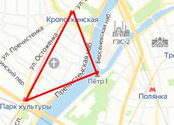

**Формат:** Фамилия_Имя_Отчество

**Ответ:** Хилков_Андрей_Яковлевич

**Решение:** Решение простое но нудное. У нас есть часть карты, там есть улицы и переулки, просто перебирая их искать информацию о этих людях в интернете, рано или поздно наткнемся на Андрея Хилкова, он нам и нужен.

### Цепочка событий ч.2

**Стоимость:** 35

**Описание:** В каком году и в какую страну ОН был направлен послом с особым поручением?

**Формат:** Год_Страна

**Ответ:** 1700_Швеция

**Решение:** Ну исходя из прошлого задания, в этом просто нужно пробежаться по биографии Хилкова и найти нужную дату и место

### Цепочка событий ч.3

**Стоимость:** 40

**Описание:** Как звали короля ЭТОЙ страны в ТОТ год?

**Формат:** Имя_число

**Ответ:** Карл_12

**Решение:** Ну король швеции в 1700 году был Карл 12

### Цепочка событий ч.4

**Стоимость:** 45

**Описание:** Участие ЭТОГО КОРОЛЯ привело к объединению нескольких стран в Европе. А что произошло в дальнейшем?

**Формат:** Название события

**Ответ:** Великая_Северная_Война / Северная_война

**Решение:** Сперва был заключен Северный Союз, а после была начата Великая Северная Война.

### Цепочка событий ч.5

**Стоимость:** 50

**Описание:** Перед началом ЭТОГО ИНЦИДЕНТА, царь Руси, послал с разведывательными целями в район крепостей Нарва и Орешек своего человека. Кто это был?

**Формат:** Имя_Отчество_Фамилия

**Ответ:** Василий_Дмитриевич_Корчмин

**Решение:** Ищем человека которого перед началом северной войны отправили в районы крепости Нарва и Орешек(Нотебург), это был Василий Корчмин.

---

### Он дипломат или разведчик? Часть 1

**Стоимость:** 40

**Описание:** Интересный факт. Ост-Индская компания существовала более, чем в одной стране. И эти компании колонизировали не только собственно Индию. А теперь вам предстоит самим разобраться с происхождением этого слова и понять, о какой стране Европы будет идти речь.

Напишите, как эту страну чаще всего ее называли в России.

**Ответ:** Голландия

**Решение:** В задании сказано разобраться с происхождением слова «Ост-Индская компания». Ост-Индия - слово из нидерландского языка. НО. Хотя страна и имеет название Нидерланды, в России ее чаще называли Голландией.

### Он дипломат или разведчик? Часть 2

**Стоимость:** 50

**Описание:** После окончания миссии Великого посольства, в ЭТОЙ стране было создано постоянное дипломатическое представительство России. Напишите ФИО чрезвычайного и полномочного посла этой страны, которого назначил Петр I. 

**Формат:** Фамилия_Имя_Отчество

**Ответ:** Матвеев_Андрей_Артамонович

**Решение:** для поиска ответа на этот вопрос необходимо найти статьи, посвященные посольствам Петра, в которых будет дан ответ.

### Он дипломат или разведчик? Часть 3

**Стоимость:** 70

**Описание:** Словно определяя начальные очерки истории российской внешней разведки, послы при Петре занимались не только представительскими функциями. Они передавали сведения о состоянии дел. Притом не только в той стране, где находились, но и об удаленных на тысячи верст. Более того, ЕМУ удалось сообщить Петру 1 информацию о ходе переговоров в 1699 году быстрее, чем царь получил ее от главы делегации. Назовите город, в котором проходили переговоры.

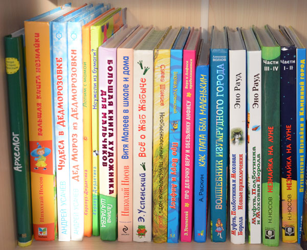

**Формат:** Город

**Ответ:** Константинополь

**Решение:** Для решения необходимо обратить внимание на самый первый деепричастный оборот. Во-первых, он имеет нетипичный стиль, по сравнению с остальным текстом. Во-вторых, если что-то можно определить, нужно понять, что это. «Очерки истории российской внешней разведки» - многотомник про разведку. Слово «начальный» указывает собой на начало серии, то есть на первый том. Ну и с томом можно определиться просто анализируя их содержание. Ответ находится на 18 странице.

### Он дипломат или разведчик? Часть 4

**Стоимость:** 70

**Описание:** А кто тогда был главой русской делегации? Укажите его фамилию.

**Ответ:** Украинцев

**Решение:** Продолжаем рассматривать ту же ситуацию. И продолжаем чтение книги. Ответ указан чуть дальше.

### Он дипломат или разведчик? Часть 5

**Стоимость:** 80

**Описание:** Продолжая те же очерки, наш посол-разведчик сообщил о тайном решении Карла XII в сентябре 1708 отказаться от движения прямо и свернуть на юг, где вскоре произошла решающая битва, на чей исход очень сильно повлияла данная информация. Назовите название битвы, что произошла после данного решения.

**Формат:** Прилагательное_существительное

**Ответ:** Слово_слово

**Решение:** Существует 2 варианта решения: продолжение чтение той же книги или логический. Известны: одна из сторон сражения, дата, и что последующее сражение будет решающим (считай - генеральным). И таковым являлась Полтавская битва.

---

### Ярмарка мастеров часть 1

**Стоимость:** 70

**Описание:** На фотографии указано место, где он родился, а еще там же  21 веке ему был установлен памятник. Один из юго-восточных округов Москвы назван в честь него. Укажите его Фамилию Имя Отчество.

**Формат:** Фамилия_Имя_Отчество

**Ответ:** Лефорт_Франц_Яковлевич

**Решение:** Смотрим на картинку, обращаем внимание на лимон и йод, это средства стеганографии, поэтому догадываемся, что необходимо залить ее цветом, чтобы получить подсказку, также в левом верхнем углу находится очень нечеткая фотография, можно присмотреться к ней внимательно и увидеть лефортовский парк, в честь Лефорта назван район Москвы, а в Женеве стоит ему памятник и он там родился

### Ярмарка мастеров часть 2

**Стоимость:** 80

**Описание:**  Если бы ОН в 21 веке поехал в эту страну для заключения договора, то его клавиатура выглядела примерно так, как показано на изображении. В конечном итоге ОН заключил договор, который получил название в честь маленького городка, в котором и проходили переговоры со страной. Но, кстати, сквозь века ему все же удалось передать нам сообщение. Укажите его Фамилию Имя Отчество.

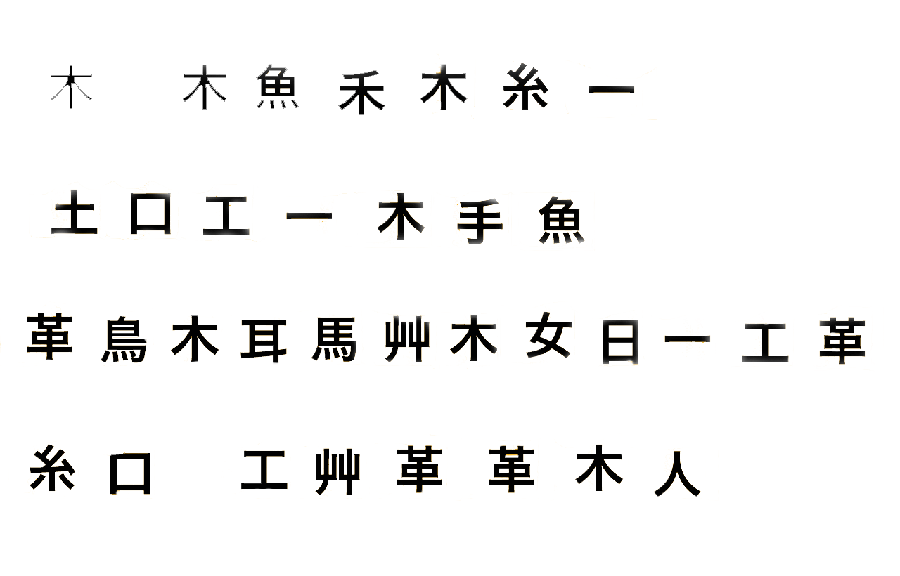

**Формат:** Фамилия_Имя_Отчество

**Ответ:** Головин_Федор_Алексеевич/Головин_Фёдор_Алексеевич

**Решение:** по картинке определяем, что это какой-то азиатский алфавит, точнее Китайский, ищем кто заключал с Китаем договор, это Головин. Текст, который спрятан - это подсказка на следующее задание

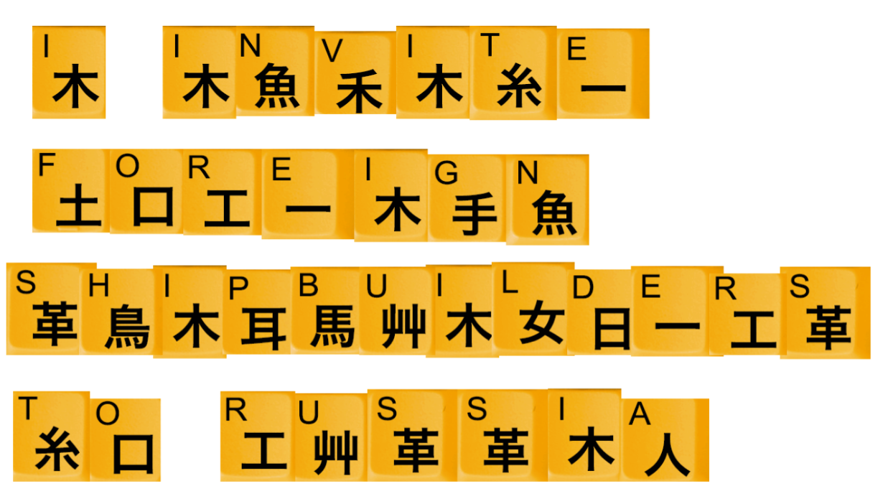

### Ярмарка мастеров часть 3

**Стоимость:** 80

**Описание:** В каком году началось задание, которое связывает двух людей из предыдущих вопросов?

**Формат:** ГГГГ

**Ответ:** 1697

**Решение:** читаем биографии Лефорта и Головина, понимаем, что их связывает Великое посольство, находим год начала этой дипмиссии.

### Ярмарка мастеров часть 4

**Стоимость:** 80

**Описание:** По результатам дипмиссии, через 4 года после ее окончания, был издан закон. Сколько тысяч человек прибыло благодаря этому закону?

**Формат:** число

**Ответ:** 8/8000

**Решение:** ищем, дату окончания Великого посольства, прибавляем к ней 4 года, это 1702. Ищем законы, принятые в 1702 году Петром I, находим Манифест «О вызове иностранцев в Россию».

### Ярмарка мастеров часть 5

**Стоимость:** 90

**Описание:** Когда Петр I прибыл с миссией в Амстердам, то он стал нанимать к себе на службу разных талантливых людей. Один из них в дальнейшем стал адмиралом на флоте у Петра.  Укажите его имя и отчество, которые он получил, переехав в Россию.

**Формат:** Имя_Отчество

**Ответ:** Корней_Иванович

**Решение:** ищем в интернете по ключевым словам “Великое посольство в амстердаме кого нанял Петр 1”, читаем статью, понимаем, что это Крюйс, читаем его биографию и узнаем ответ

### Ярмарка мастеров часть 6

**Стоимость:** 90

**Описание:** Во время этой миссии Петра I сопровождал в Голландии один очень хороший человек, который помог ему найти адмирала. Что опубликовал он в 1687 году? В ответ укажите полное наименование этой вещи.

**Ответ:**  Новая географическая карта Северной и Восточной части Азии и Европы, простирающаяся от Новой Земли до Китая/Новая географическая карта Северной и Восточной части Азии и Европы простирающаяся от Новой Земли до Китая

**Решение:** По упоминании в предыдущей части Крюйса производим поиск в интернете его биографии. Читаем, понимаем, что Витсен помог Петру I найти Корнелиуса. Далее читаем биографию Витсена  и находим ответ.
